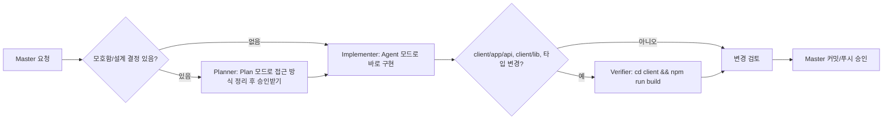
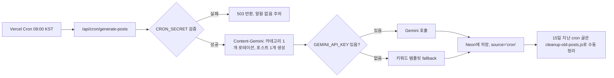
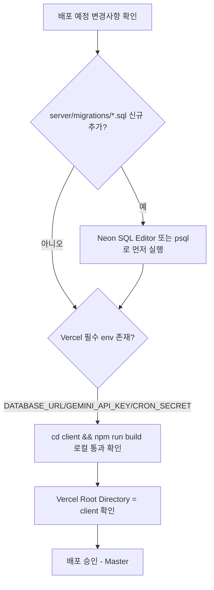
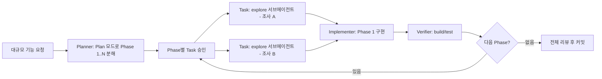

# Gemini + Cursor 기반 개발 오케스트레이션 설계

> 참고: [oh-my-claudecode (OMC)](https://github.com/Yeachan-Heo/oh-my-claudecode) README.ko.md의 아이디어(멀티 에이전트 오케스트레이션, plan→exec→verify 파이프라인, 프로젝트 스킬, 역할 분담)를 **벤치마킹**하되, Claude Code 플러그인을 그대로 이식한 것이 **아니라** Master의 실제 스택(Cursor Agent/서브에이전트, Gemini API, Vercel, Neon)에 맞춰 새로 설계한 문서입니다.

---

## 1. 목표 · 비목표

### 목표

| 구분 | 내용 |
|---|---|
| Gemini가 할 일 | 콘텐츠 생성/운영 자동화 (블로그 cron), 챗봇 응답, 요약/번역/개선 등 앱 내 AI 기능, (선택) 코드 리뷰 보조용 텍스트 생성 |
| Cursor Agent가 할 일 | 코드 작성/리팩터링, 서브에이전트를 통한 조사·구현·검증, `npm run build` 등 게이트 실행 |
| Master(사람)가 할 일 | 커밋/푸시 승인, 배포(Vercel) 트리거, 비밀키(`GEMINI_API_KEY`, `DATABASE_URL`, `CRON_SECRET`) 발급·회전, 최종 의사결정 |

### 비목표 (명시적으로 하지 않는 것)

- **OMC의 Team/HUD/tmux 병렬 워커**: Windows + Cursor 환경에서는 tmux 세션 기반 다중 터미널 오케스트레이션이 성립하지 않음. 이 설계는 tmux를 전제로 하지 않는다.
- **Claude Code 플러그인 시스템 이식**: OMC는 Claude Code 전용 플러그인(커맨드/에이전트 32종 등록 방식)이라 Cursor에는 그대로 설치할 수 없다. 여기서는 "아이디어"만 가져온다.
- **32개 전문 에이전트 페르소나**: 실제 이 프로젝트 규모(1인 포트폴리오+블로그)에는 과도하다. 아래 4~6개 역할로 축소한다.
- 이 문서는 **OMC 클론이 아니라 OMC에서 영감을 받은 자체 설계**임을 다시 한번 명시한다.

---

## 2. 역할 체계

OMC의 32개 전문 에이전트 대신, 이 repo 규모에 맞는 소수 정예 역할 5개를 정의한다. 각 역할은 별도 소프트웨어가 아니라 **기존 도구(Cursor 서브에이전트, cron route, npm 스크립트)에 매핑된 "역할 정의"**다.

| 역할 | 하는 일 | 실제 매핑 |
|---|---|---|
| **Planner** | 요구사항이 모호하거나 여러 파일/아키텍처 결정이 걸린 작업을 단계별 계획으로 분해 | Cursor **Plan 모드**, 또는 `Task` 툴의 `generalPurpose` 서브에이전트(조사 전용, `readonly: true`) |
| **Implementer** | 실제 코드 작성/수정 | Cursor **Agent 모드** 메인 세션, 또는 병렬 작업 시 `Task` 툴 `generalPurpose`/`explore` 서브에이전트 |
| **Verifier** | 변경사항이 빌드/타입체크/테스트를 통과하는지 검증하는 게이트 | `cd client && npm run build`, `cd server && npm test`, `.cursor/rules/client-build-before-ship.mdc` |
| **Content-Gemini** | 블로그 자동 포스팅, 챗봇 응답, 요약/번역/개선 — **런타임 앱 기능**이며 개발 오케스트레이션과는 분리된 레이어 | `client/app/api/cron/generate-posts/route.ts`, `client/app/api/ai/*`, `server/scripts/auto-generate-posts.js` |
| **Reviewer** (선택) | 커밋 전 변경사항에 대한 보안/품질 리뷰 | `security-review` / `bugbot` 서브에이전트 (Cursor 내장, 명시적 요청 시에만 사용) |

핵심 차이: OMC는 "에이전트 = 상시 대기하는 페르소나 프로세스"이지만, 여기서는 "역할 = 특정 시점에 호출하는 도구/모드"다. 상주 프로세스가 없으므로 tmux/HUD가 불필요하다.

---

## 3. 시나리오

### 시나리오 A — 일반 버그픽스/기능 요청

### 시나리오 B — 콘텐츠/cron 관련 (Gemini 글 생성, 요약)

이 시나리오는 개발자(Implementer) 개입 없이 자동 실행되는 **운영 레이어**다. `gemini-quota-guardrails.md` 스킬 참고.

### 시나리오 C — 배포 전 체크 (env, migration, build)

`deploy-gate-checklist.md` 스킬로 체크리스트화.

### 시나리오 D — 대규모 기능 (Phase 나누기, 여러 서브에이전트 병렬)

독립적인 조사/파일 탐색은 `Task` 툴로 병렬 실행 가능(OMC의 "병렬 워커"에 해당하는 유일한 실제 지원 기능). 단, 코드 **작성**은 여러 서브에이전트가 같은 파일을 동시에 건드리면 충돌하므로, 조사는 병렬/구현은 순차를 원칙으로 한다.

---

## 4. 아티팩트 매핑

| OMC 개념 | 이 프로젝트 대응물 |
|---|---|
| 프로젝트 설정 (CLAUDE.md 등) | `AGENTS.md` |
| Skills (트리거 조건 + 절차 문서) | `.cursor/rules/*.mdc` (자동 적용 규칙) + `.cursor/skills/*.md` (신규, 수동/선택적 체크리스트) |
| team-verify 게이트 | `npm run build` (client), `npm test` (server) |
| 32개 전문 에이전트 | `Task` 툴의 `subagent_type` (generalPurpose, explore, shell 등) — Cursor가 이미 제공 |
| tmux 병렬 워커 / HUD | **비목표** (Windows, Cursor 환경 불일치) |

### 신규 스킬 파일 (`.cursor/skills/`)

이 repo에는 `.cursor/skills/` 디렉터리가 아직 없었으므로 신규 생성했다. `.cursor/rules/*.mdc`가 "항상/조건부 자동 적용"이라면, `.cursor/skills/*.md`는 "특정 작업 시 에이전트가 참고해 실행하는 체크리스트/가이드" 성격으로 구분한다.

1. **`neon-cron-checklist.md`** — cron/DB 마이그레이션 작업 시 체크리스트
2. **`gemini-quota-guardrails.md`** — AI 쿼터/fallback/모델 정책
3. **`deploy-gate-checklist.md`** — 배포 전 build/env 체크

---

## 5. Gemini 사용 원칙

### 레이어 구분

- **앱 레이어** (런타임에 실제 사용자에게 응답): `client/app/api/ai/*` (chat, summarize, translate, improve), `client/app/api/cron/generate-posts`, `client/app/api/ai-interviewer`, `client/app/api/kuuma/chat`, `client/lib/aetheria/llm-router.ts`. 이 레이어는 쿼터/구독 체크(`ai-quota-guard.ts`, `subscription/check`)를 반드시 통과해야 한다.
- **개발 보조 레이어** (Cursor Agent가 코드 작성 시 참고용으로 Gemini를 부가 활용하는 경우, 예: 코드 리뷰 초안 생성): 현재 repo에는 별도 구현이 없음. 필요 시 앱 레이어와 완전히 분리된 스크립트/워크플로로 추가하고, 프로덕션 쿼터/구독 로직에 절대 영향을 주지 않아야 한다.

### 모델명 통일 제안

현재 모델명이 파일마다 하드코딩되어 다르다:

- `client/app/api/ai/chat/route.ts` 등: `gemini-2.5-flash-preview-05-20`
- `client/lib/aetheria/llm-router.ts`: `gemini-2.5-flash`

**제안**: `GEMINI_MODEL` 환경변수를 `server/.env` / Vercel에 추가하고, 각 호출부에서 `process.env.GEMINI_MODEL || '<기존 기본값>'`로 폴백하도록 점진적으로 통일한다. (본 작업에서는 문서화만 하며 코드는 수정하지 않음 — 실제 적용은 별도 태스크로 진행 권장)

### 비용/한도 가드레일 (기존 정책과 정합)

- Vercel Hobby: cron 1일 1회, `maxDuration` 60초 → 포스트 생성은 1회 실행당 1건만.
- Neon 무료 플랜: 커넥션/스토리지 한도 고려, `cleanup-old-posts.js`로 `source='cron'` 글 15일 지난 것 정리(수동 실행, cron 미연동).
- 앱 레이어 쿼터: `ai-quota-guard.ts` (개선/번역/요약), `ai-chat-quota.ts`, `anonymous-quota.ts`, `subscription` 테이블 — 무료 사용자 일일 한도 초과 시 403 + `DAILY_LIMIT_EXCEEDED`.
- `GEMINI_API_KEY` 부재 시 반드시 안전한 fallback(키워드 템플릿 등)으로 동작해야 하며, 500 에러로 앱이 죽으면 안 된다.

자세한 절차는 `gemini-quota-guardrails.md` 참고.

---

## 6. 검증 게이트 (OMC team-verify 대응)

| 트리거 | 필수 게이트 |
|---|---|
| `client/app/api/**`, `client/lib/**`, API에서 쓰는 TS union/type 변경 | `cd client && npm run build` — exit 0 확인 (타입체크 포함) |
| `server/**` 변경 | 가능하면 `cd server && npm test` (테스트 파일 존재 시) |
| `server/migrations/*.sql` 신규 추가 | Neon에 **수동 실행** 안내 (자동 실행 스크립트 없음 — README/AGENTS.md에 안내문 추가 권장) |
| 배포 직전 | env 체크리스트 (`deploy-gate-checklist.md`) |

이 게이트들은 이미 `AGENTS.md`와 `.cursor/rules/client-build-before-ship.mdc`에 정의되어 있으며, 이번 설계는 이를 재확인하고 cron/배포 시나리오까지 체크리스트로 확장한 것이다.

---

## 7. 한계 · 비목표 (재확인)

- **tmux/Team 병렬 워커 불가**: Windows 환경 + Cursor는 OMC의 tmux 세션 기반 HUD를 지원하지 않는다. 병렬 처리가 필요하면 Cursor `Task` 툴의 서브에이전트(조사 전용)를 활용한다.
- **Claude Code 플러그인 시스템 자체는 이식 불가**: OMC는 Claude Code의 커맨드/에이전트 등록 메커니즘에 의존한다. Cursor는 다른 확장 모델(Rules, Skills, Task 서브에이전트)을 쓴다.
- **이것은 OMC 클론이 아니다.** OMC의 "plan → exec → verify" 철학과 "프로젝트별 스킬" 아이디어만 차용했고, 구체적 구현(역할 수, 매핑 대상, 검증 게이트)은 이 repo의 실제 스택과 규모에 맞춰 새로 설계했다.
